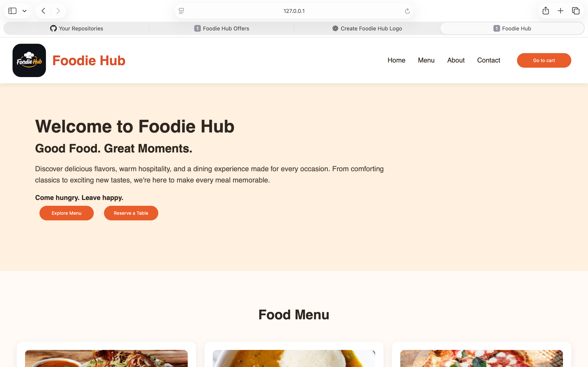
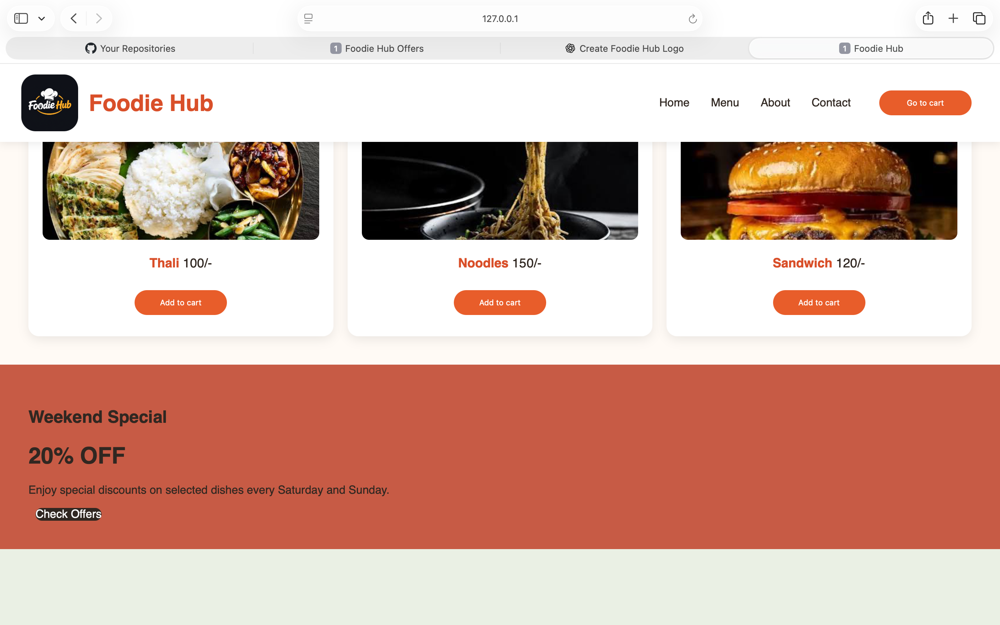
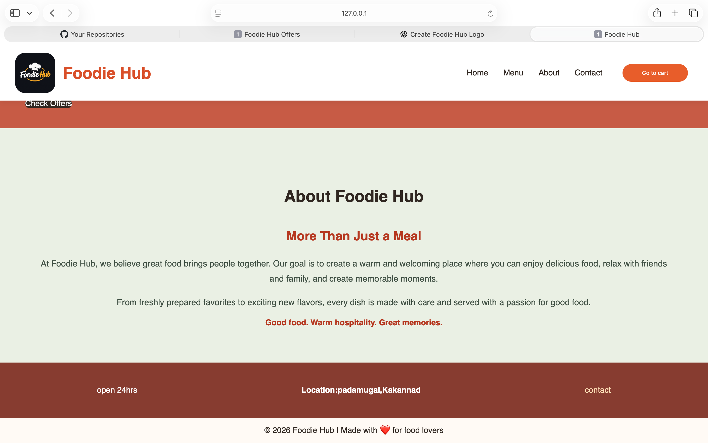
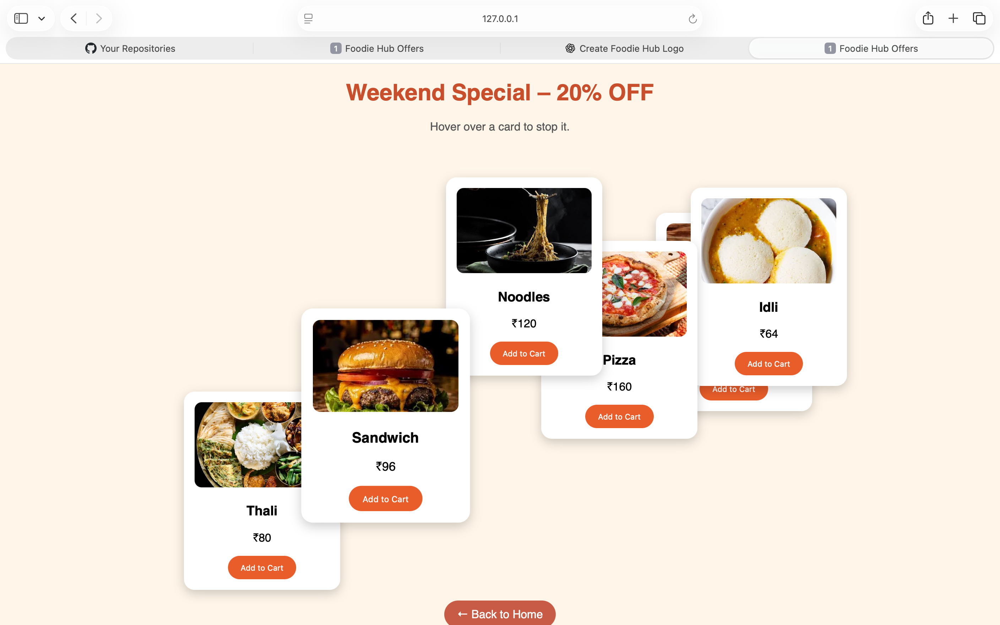

# 🍽️ Foodie Hub

Foodie Hub is a modern and responsive restaurant landing page built using **HTML and CSS**.

The website is designed to showcase food items, special weekend offers, restaurant information, and contact details in a clean and attractive layout.

## ✨ Features

* Responsive navigation bar
* Sticky header
* Attractive hero section
* Food menu cards
* Weekend special offer section
* Hover effects and transitions
* Responsive grid layout
* About section
* Contact and location information
* Mobile-friendly design

## 🛠️ Technologies Used

* HTML5
* CSS3
* CSS Grid
* Flexbox
* Media Queries

## 📁 Project Structure

```text
Foodie-Hub/
│
├── index.html
├── hub.css
├── logo.png
├── images-3.jpeg
├── images-5.jpeg
├── images-7.jpeg
├── images.jpeg
├── images-8.jpeg
├── images-9.jpeg
└── README.md
```

## 📱 Responsive Design

The website layout automatically adjusts based on the screen size.

* Desktop: 3 food cards per row
* Tablet: 2 food cards per row
* Mobile: 1 food card per row

## 🚀 Future Improvements

The following features can be added in future versions:

* Add to Cart functionality using JavaScript
* Cart quantity management
* Total price calculation
* Remove items from cart
* Table reservation form
* Food search and filtering
* Login and signup
* Backend integration

## 🌐 Live Website

https://github.com/NavaneethB007/Foodie-Hub.git

## 📸 Preview

<p align="center">
  
</p>
<p align="center">
  
</p>
<p align="center">
  
</p>
<p align="center">
  
</p>

## 👨‍💻 Author

**Navaneeth B**

GitHub: [NavaneethB007](https://github.com/NavaneethB007)

---

⭐ If you like this project, consider giving the repository a star.
